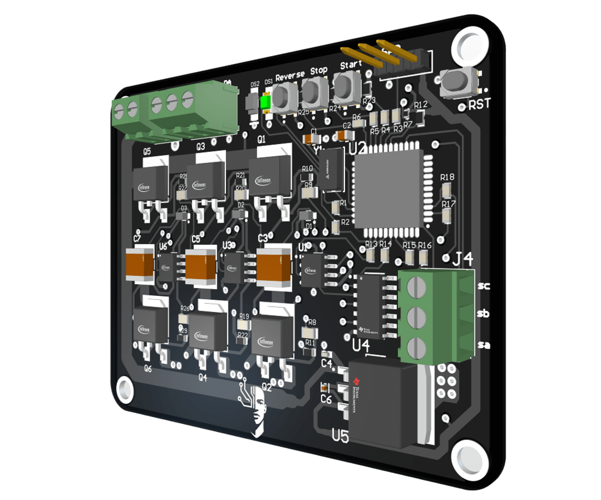

# 3-Phase BLDC Motor Controller (ESC)

Open Hardware & Firmware for a **Hall-sensor-based 6-step BLDC motor controller** using **PIC18F**.

---

## 📌 Project Overview

This project implements a **3-phase BLDC motor controller** using Hall sensor-based 6-step commutation with PWM speed control. The system uses a **PIC18F46K22 microcontroller** and IR2101 gate drivers for driving the MOSFET bridge.

---

## 🛠 Features

* ✅ 3-phase BLDC control using 6-step commutation
* ✅ Speed control using analog potentiometer (ADC) with PWM
* ✅ Direction control with REVERSE button
* ✅ Start/Stop functionality
* ✅ LED indicators for direction status
* ✅ Open Hardware under CERN OHL v2 license

---

---

## ⚙️ Hardware

* **Microcontroller:** PIC18F46K22
* **Gate Driver:** IR2101
* **MOSFETs:** IRF540N or IRFZ44N
* **Sensors:** Hall sensors for rotor position
* **PCB:** 4-layer (2 signal, 2 GND planes)
* **Simulation:** Proteus for pre-validation
* **CAD:** Altium Designer for schematic and layout

---

## 🔧 Firmware

* Developed in CCS C for the PIC18F46K22.
* Uses interrupts for Hall sensor capture and commutation lookup table.
* ADC reads potentiometer voltage to control PWM duty cycle.
* PWM generated for speed control.

---

## 🛡️ Licensing

This hardware project is licensed under the **CERN Open Hardware License v2 (CERN OHL v2)**.  
See the [LICENSE](LICENSE) file for details.

---

## 🤝 Contributing

* ✅ This project is open for modifications, and improvements.
* ✅ Pull requests and hardware validation feedback are welcome.
* ✅ Please credit if you use this design in your projects.

---

## 📸 Preview

---

## 📫 Contact

If you have suggestions or questions feel free to contact.
- 📧 Email: fawazyousifabkr00@gmail.com
- 🛠 [My Hackaday Profile](https://hackaday.io/Fawwazoa)

